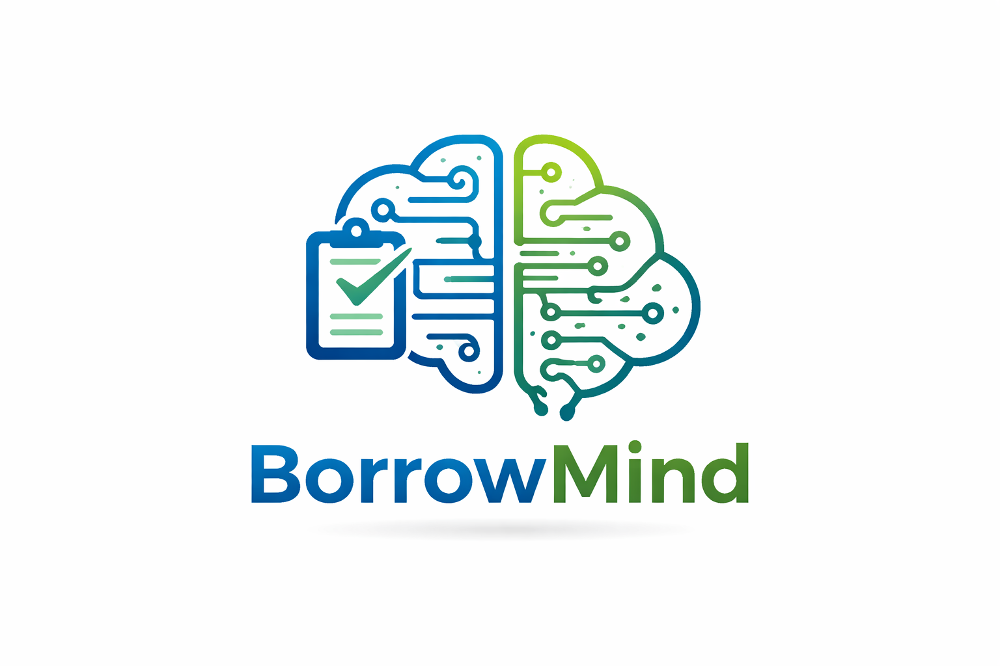
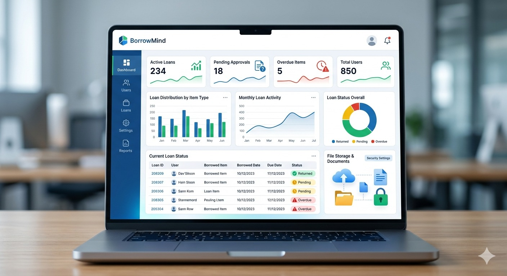

# BorrowMind - Sistema de Gestión de Préstamos

  

BorrowMind es un sistema de gestión de préstamos desarrollado en Python, diseñado para administrar usuarios, inventario, préstamos, devoluciones y procesos de control asociados al incumplimiento de tiempos de entrega. El sistema está orientado a operar mediante interfaz de consola y almacenamiento en archivos planos, garantizando persistencia de la información y trazabilidad de las operaciones realizadas.

---

## Integrantes del equipo

### Santiago Paniagua  
Estudiante de Ingeniería Industrial en la Universidad de Antioquia (UdeA). Actualmente vinculado al área de desarrollo comercial en Grupo EMI (Medellín). Cuenta con experiencia en análisis de procesos y automatización de tareas. Se destaca por su pensamiento lógico, capacidad de resolución de problemas y enfoque en el desarrollo de soluciones prácticas.

### Olga Lucía Andica Narváez  
Estudiante de Ingeniería Industrial. Vinculada laboralmente a UTS Rionegro como UTS Tech Service Desk, brindando soporte técnico remoto a múltiples organizaciones. Se caracteriza por su responsabilidad, trabajo colaborativo, adaptabilidad y habilidades comunicativas que favorecen la interacción en entornos profesionales.

### Estefanía Rivera Castaño  
Estudiante de Ingeniería Industrial. Posee habilidades en aprendizaje autónomo, dominio de idiomas y formación en disciplinas artísticas como pintura y dibujo, además de práctica en karate. Se destaca por su disciplina, creatividad y capacidad de adaptación.

---

## Descripción del proyecto

BorrowMind es una aplicación de consola desarrollada en Python que permite gestionar el préstamo de diversos tipos de artículos, tales como herramientas, libros, videojuegos, entre otros. El sistema centraliza la administración de usuarios, control de inventario, registro de préstamos y seguimiento de devoluciones.

La aplicación contempla mecanismos de control basados en fechas, permitiendo identificar préstamos activos, generar alertas por incumplimiento de tiempos establecidos y ejecutar procesos automáticos como la conversión de préstamos en ventas cuando se superan los límites definidos.

Adicionalmente, el sistema incluye funcionalidades para la generación de reportes, certificaciones de devolución y documentos asociados a transacciones, utilizando almacenamiento en archivos planos como medio de persistencia.

---

## Objetivo

Desarrollar una solución de software que permita administrar el ciclo completo de préstamos de manera estructurada, aplicando principios de Programación Orientada a Objetos (POO), manejo de archivos planos y validaciones de datos, con el fin de simular un sistema real de control y gestión de activos prestados.

---
## Visión

Convertirse en una solución tecnológica líder en la gestión de préstamos de objetos, reconocida por su eficiencia, confiabilidad y facilidad de uso, permitiendo a los usuarios llevar un control organizado de sus bienes y optimizar la administración de sus recursos.

A futuro, BorrowMind busca evolucionar hacia una plataforma más completa e intuitiva, integrando nuevas funcionalidades, interfaces más amigables y posibles aplicaciones web o móviles que amplíen su alcance y utilidad.

  

---

## Tecnologías utilizadas

- Lenguaje de programación: Python  
- Paradigma de programación: Programación Orientada a Objetos (POO)  
- Persistencia de datos: Archivos planos (TXT y CSV)  
- Control de versiones: Git y GitHub  

---

## Características del sistema

- Arquitectura modular basada en clases y objetos  
- Registro y gestión de usuarios con validaciones de entrada  
- Administración de inventario de artículos  
- Control de préstamos y devoluciones  
- Validación de tiempos de préstamo mediante fechas  
- Generación de notificaciones por incumplimiento  
- Conversión automática de préstamos en ventas según reglas definidas  
- Generación de reportes y documentos en archivos planos  
- Diseño escalable para futuras ampliaciones del sistema  

---

## Alcance

El sistema está diseñado para operar en un entorno de consola, con almacenamiento local de la información. No incluye interfaz gráfica, ni conexión a bases de datos externas, aunque su arquitectura permite futuras integraciones.

---

## Justificación

Este proyecto responde a la necesidad de implementar una solución que permita controlar de manera eficiente el préstamo de bienes, evitando pérdidas de información, falta de seguimiento y desorganización en la gestión de activos. A través de la implementación de principios de ingeniería de software, se busca simular un entorno real de administración de recursos prestados.

---

## Notas del proyecto

El desarrollo de este sistema se realiza con fines académicos, como parte del proceso formativo en ingeniería. El proyecto integra conceptos de programación estructurada y orientada a objetos, así como el uso de herramientas de control de versiones y buenas prácticas de desarrollo colaborativo.
